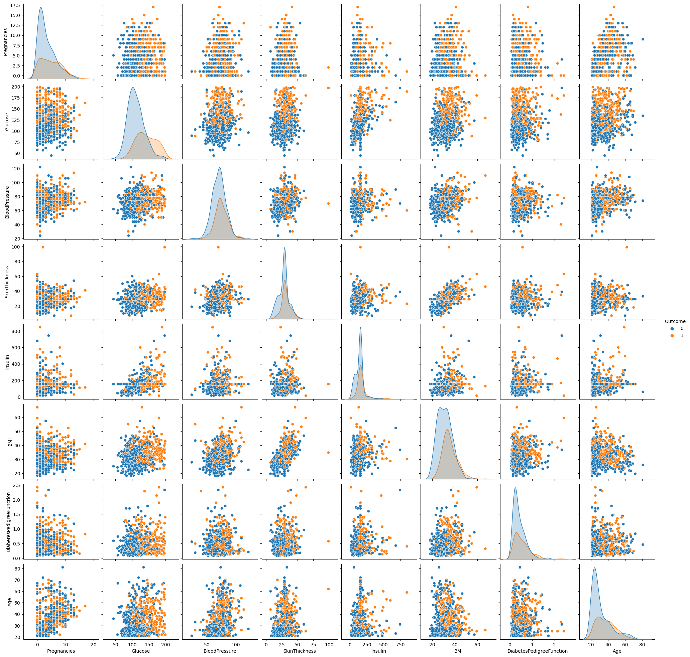
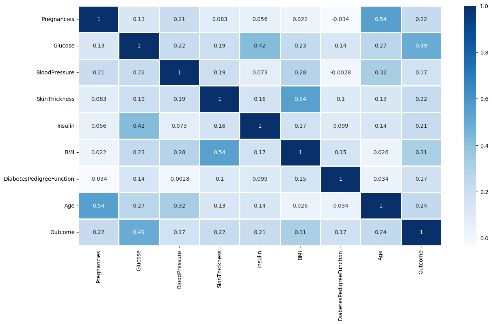
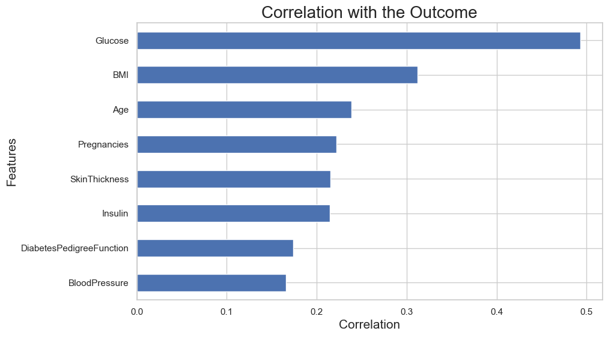
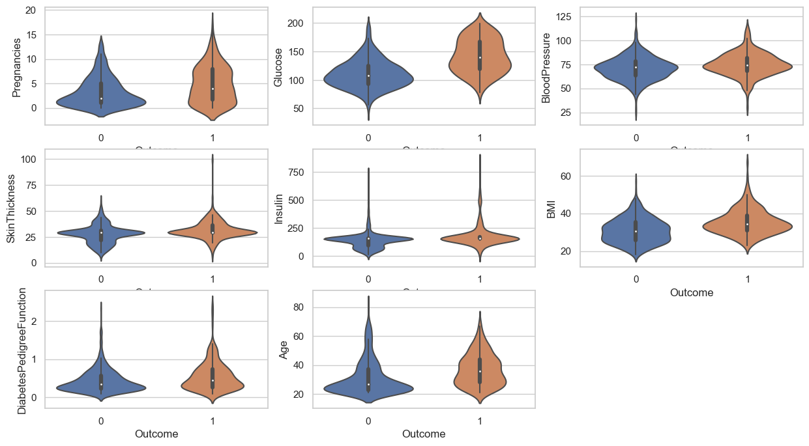

# <center> 《神经网络与深度学习》课程实验作业（一）
# <center> 实验内容：深度学习基础
何尉宁 2021213599

### 要求：
**机器学习：回归问题**
> 皮马印第安人糖尿病数据集由年龄大于等于21 岁的皮马印第安女性的已有诊断信息组
成，包含若干医学预测变量和一个目标变量 Outcome，共九个字段。其中预测变量包括患者
的怀孕次数、BMI、胰岛素水平、年龄等。\
> 请运用回归模型分析糖尿病数据集中自变量和因变量之间的关系，对某人是否患糖尿病
进行预测。

- [使用特征工程方法对数据集中的特征变量进行处理并在实验报告中作出说明](#one1)
- [使用逻辑回归模型完成实验并绘制逻辑回归散点图<font color = "red"> (Novelty: K-Fold & MICE) </font>](#one2)
- [使用train_test_split 函数对数据集进行拆分，并在拆分得到的测试集上测试模型准确率。我设置的`ratio = 0.8`](#one3)
- [试分析多个特征值（自变量）与病情（因变量）的关系，依据与病情的关联性对自变量进行排序并进行可视化展示](#one4)

**多层感知机：分类问题**
> CIFAR-10 数据集是深度学习中常用的数据集，其包含 60000 张 32×32 色图像，分为
10 个类，每类6000 张。有50000 张训练图片和10000 张测试图片。\
> 请基于该数据集搭建包含三个及以上的全连接层的多层感知机网络，以解决10 分类问
题。

- [输出网络结构](#two1)
- [使用tensorboard对训练过程中的loss和accuracy 进行可视化展示](#two2)
- [保存训练模型为模型文件，并使用训练好的模型对测试集中的图片进行预测，输出预测结果与预测概率](#two3)
- [画出训练集和验证集的混淆矩阵](#two4)
- [分析网络参数（例如网络深度、不同的激活函数、神经元数量等）对预测结果的影响](#two5)
- [在损失函数为交叉熵的情况下，对比网络最后一层是否使用softmax 的性能差异并分析其产生的原因](#two6)

  

---
# 1. 皮马印第安人糖尿病数据集 (Acc = 84.2%)
<h2 id = "one1"> 1.1 特征工程 </h2>

### 1.1.1 数据读取与观察
```python
import pandas as pd
import numpy as np
import matplotlib.pyplot as plt
%matplotlib inline

diabetes_data = pd.read_csv('../Assignment1_dataset/diabetes.csv')
diabetes_data.head()
# diabetes.shape
```
<div>
<style scoped>
    .dataframe tbody tr th:only-of-type {
        vertical-align: middle;
    }

    .dataframe tbody tr th {
        vertical-align: top;
    }

    .dataframe thead th {
        text-align: right;
    }
</style>
<table border="1" class="dataframe">
  <thead>
    <tr style="text-align: right;">
      <th></th>
      <th>Pregnancies</th>
      <th>Glucose</th>
      <th>BloodPressure</th>
      <th>SkinThickness</th>
      <th>Insulin</th>
      <th>BMI</th>
      <th>DiabetesPedigreeFunction</th>
      <th>Age</th>
      <th>Outcome</th>
    </tr>
  </thead>
  <tbody>
    <tr>
      <th>0</th>
      <td>6</td>
      <td>148</td>
      <td>72</td>
      <td>35</td>
      <td>0</td>
      <td>33.6</td>
      <td>0.627</td>
      <td>50</td>
      <td>1</td>
    </tr>
    <tr>
      <th>1</th>
      <td>1</td>
      <td>85</td>
      <td>66</td>
      <td>29</td>
      <td>0</td>
      <td>26.6</td>
      <td>0.351</td>
      <td>31</td>
      <td>0</td>
    </tr>
    <tr>
      <th>2</th>
      <td>8</td>
      <td>183</td>
      <td>64</td>
      <td>0</td>
      <td>0</td>
      <td>23.3</td>
      <td>0.672</td>
      <td>32</td>
      <td>1</td>
    </tr>
    <tr>
      <th>3</th>
      <td>1</td>
      <td>89</td>
      <td>66</td>
      <td>23</td>
      <td>94</td>
      <td>28.1</td>
      <td>0.167</td>
      <td>21</td>
      <td>0</td>
    </tr>
    <tr>
      <th>4</th>
      <td>0</td>
      <td>137</td>
      <td>40</td>
      <td>35</td>
      <td>168</td>
      <td>43.1</td>
      <td>2.288</td>
      <td>33</td>
      <td>1</td>
    </tr>
  </tbody>
</table>
</div>

**观察分析：**

我们可以发现label存储在`Outcome`中，同时数据集的特征有“怀孕”，“葡萄糖”，“血压”，“皮肤厚度”，“胰岛素”，“BMI”，“糖尿病谱系功能”，“年龄”共8个方面。\
通过CSV可以发现缺省值均为0，所以我们将其替换为`NaN`后再进行处理。

### 1.1.2 数据清洗与填充

1. 填充：\
   (1). 直接使用`median`/`mean`/`mode`填充缺值\
   (2). 使用`Outcome`作为标签，映射至缺值中
2. 纠错：\
    ~~有个800多胰岛素的姐们引起了我的注意，我本来打算去查一下表，看能不能规范一下异常数据的，结果发现看不懂。~~\
    <font color = 'red'> 尝试删除离群值之后发现效果并不理想，因为有些极端的数据与患病概率是正相关的，所以删除后会减弱相关性。这个阈值的把控非常困难，很容易删除有用的数据。</font>\
    例如：\
    那个800多胰岛素的姐们，一看就不正常\
    那个60多BMI的姐们，一看就不正常
    

```python
# 用平均值填充NaN
diabetes_data.fillna(diabetes_data.mean(), inplace = True)
diabetes_data.isnull().any()
```

### 1.1.3 可视化清洗后的数据

1. 以`Outcome`为标准，绘制热力图
```python
import seaborn as sns

diabetes_data_raw = pd.read_csv('../Assignment1_dataset/diabetes.csv')
diabetes_data.to_csv('../Assignment1_dataset/diabetes_clean.csv', index=False)
diabetes_data_clean = pd.read_csv('../Assignment1_dataset/diabetes_clean.csv')
# 将outcome加回来
diabetes_data_clean['Outcome'] = diabetes_data_raw['Outcome']
# 用seaborn绘制散点图
sns.pairplot(diabetes_data_clean, hue = 'Outcome', diag_kind = 'kde')
```


### 1.1.4 特征查看与选取

**该部分详细代码将在`问题4`中展示**\
**特征之间的相关性：**\
很容易可以发现，这些症状都与是否患糖尿病正相关，其中否患病相关性最高的三项是葡萄糖，BMI和年龄。\
同时，通过以葡萄糖为关键词，我们发现与之正相关性强的依旧是胰岛素，年龄和BMI

### 1.1.5 数据标准化

对已处理的数据进行标准化，使训练更精确
```python
from sklearn.preprocessing import StandardScaler

# 标准化数据
scaler = StandardScaler()
diabetes_data_scaled = scaler.fit_transform(diabetes_data_clean.drop(['Outcome'], axis = 1))
diabetes_data_scaled = pd.DataFrame(diabetes_data_scaled, columns = diabetes_data_clean.columns[:-1])
# diabetes_data_scaled['Outcome'] = diabetes_data_clean['Outcome']

diabetes_data_scaled.head()
```
<div>
<style scoped>
    .dataframe tbody tr th:only-of-type {
        vertical-align: middle;
    }

    .dataframe tbody tr th {
        vertical-align: top;
    }

    .dataframe thead th {
        text-align: right;
    }
</style>
<table border="1" class="dataframe">
  <thead>
    <tr style="text-align: right;">
      <th></th>
      <th>Pregnancies</th>
      <th>Glucose</th>
      <th>BloodPressure</th>
      <th>SkinThickness</th>
      <th>Insulin</th>
      <th>BMI</th>
      <th>DiabetesPedigreeFunction</th>
      <th>Age</th>
    </tr>
  </thead>
  <tbody>
    <tr>
      <th>0</th>
      <td>0.639947</td>
      <td>0.865108</td>
      <td>-0.033518</td>
      <td>6.655021e-01</td>
      <td>-3.345079e-16</td>
      <td>0.166292</td>
      <td>0.468492</td>
      <td>1.425995</td>
    </tr>
    <tr>
      <th>1</th>
      <td>-0.844885</td>
      <td>-1.206162</td>
      <td>-0.529859</td>
      <td>-1.746338e-02</td>
      <td>-3.345079e-16</td>
      <td>-0.852531</td>
      <td>-0.365061</td>
      <td>-0.190672</td>
    </tr>
    <tr>
      <th>2</th>
      <td>1.233880</td>
      <td>2.015813</td>
      <td>-0.695306</td>
      <td>8.087936e-16</td>
      <td>-3.345079e-16</td>
      <td>-1.332833</td>
      <td>0.604397</td>
      <td>-0.105584</td>
    </tr>
    <tr>
      <th>3</th>
      <td>-0.844885</td>
      <td>-1.074652</td>
      <td>-0.529859</td>
      <td>-7.004289e-01</td>
      <td>-7.243887e-01</td>
      <td>-0.634212</td>
      <td>-0.920763</td>
      <td>-1.041549</td>
    </tr>
    <tr>
      <th>4</th>
      <td>-1.141852</td>
      <td>0.503458</td>
      <td>-2.680669</td>
      <td>6.655021e-01</td>
      <td>1.465506e-01</td>
      <td>1.548980</td>
      <td>5.484909</td>
      <td>-0.020496</td>
    </tr>
  </tbody>
</table>
</div>

### 1.1.6 总结
1. 这种较小型的数据集一般数据比较准确，所以错误数据并不太可能出现
2. 离群值在这种精确的数据集中反而能反应一些特征，比如这里BMI较大的患者，大概率是因为糖尿病导致的肥胖。\
   在第一次的实验中，我用`Z-Core`删除了一定阈值外的数据，导致各特征与标签的相关性大大降低，背道而驰。

<h2 id = "one2"> 1.2 逻辑回归模型 </h2>

### 1.2.1 构建预测模型
将数据集进行拆分，其中80%作为训练集，20%作为测试集。
```python
# 构建模型
from sklearn.model_selection import train_test_split

source_x = diabetes_data_scaled
source_y = diabetes_data_clean['Outcome']
train_X, test_X, train_y, test_y = train_test_split(source_x, source_y, test_size = 0.2, random_state = 0)

# 训练集与测试集的大小
print("train data:  ", train_X.shape)
print("test data:   ", test_X.shape)
print("train label: ", train_y.shape)
print("test label:  ", test_y.shape)
```
```output
train data:   (614, 8)
test data:    (154, 8)
train label:  (614,)
test label:   (154,)
```

### 1.2.2 训练模型
1. 选择Logistic Regression对数据进行训练\
同时选择评估模型对预测结果进行输出
```python
from sklearn.linear_model import LogisticRegression
from sklearn.metrics import accuracy_score, confusion_matrix

# 逻辑回归
lr = LogisticRegression()
lr.fit(train_X, train_y)
pred_y = lr.predict(test_X)

# 准确率
print("Accuracy: ", accuracy_score(test_y, pred_y))
# 混淆矩阵
confusion_matrix(test_y, pred_y)
```
```Output
Accuracy:  0.8116883116883117
array([[97, 10],
       [19, 28]], dtype=int64)
```
2. 修改模型超参数后再次训练\
   <font color = "orange"> 加入L2正则化，同时增大迭代次数 </font>
```python
lr = LogisticRegression(C = 0.1, max_iter = 1000)
lr.fit(train_X, train_y)
pred_y = lr.predict(test_X)
print("Accuracy: ", accuracy_score(test_y, pred_y))
```
```Output
Accuracy:  0.8051948051948052
```

### 1.2.3 模型改进 (<font color = "red"> K-Fold & MICE </font>)

#### K折交叉验证
_猜测：对于这种小型数据集，使用K折交叉验证是否能再提升一些性能_
```python
# 试了一下sklearn的函数, 后面附上手写K-Fold
from sklearn.model_selection import cross_val_score

LR = LogisticRegression(C = 1, max_iter = 100)
scores = cross_val_score(LR, source_x, source_y, cv = 10)
# 打印每折的准确率
for i in range(len(scores)):
    print("Fold %d: %f" % (i + 1, scores[i]))
"""
def get_k_fold_data(k, i, x, y):
assert k > 1
fold_size = x.shape[0] // k # calculate the size of each fold
x_train, y_train = None, None
for j in range(k):
    idx = slice(j * fold_size, (j + 1) * fold_size) # slice the data into k folds
    x_part, y_part = x[idx, :], y[idx]
    if j == i:
        x_valid, y_valid = x_part, y_part
    elif x_train is None:
        x_train, y_train = x_part, y_part
    else:
        x_train = torch.cat((x_train, x_part), 0)
        y_train = torch.cat((y_train, y_part), 0)
return x_train, y_train, x_valid, y_valid # return the training data and validation data for each fold
"""
```
```Output
Fold 1: 0.753247
Fold 2: 0.766234
Fold 3: 0.792208
Fold 4: 0.688312
Fold 5: 0.779221
Fold 6: 0.792208
Fold 7: 0.779221
Fold 8: 0.792208
Fold 9: 0.710526
Fold 10: 0.842105
```
效果很好，第十折直接飙到<font color = "orange"> 84.2% </font>了。\
再tuning一下应该能达到85%以上，这里就不尝试了

#### MICE多元插补
_猜测：使用链式回归的缺失值填充方式，可能会带来更多正相关的数据_\
```python
# MICE填充缺失值
from sklearn.experimental import enable_iterative_imputer
from sklearn.impute import IterativeImputer

mice_imputer = IterativeImputer()
diabetes_data_mice = mice_imputer.fit_transform(diabetes_data_clean)
diabetes_data_mice = pd.DataFrame(diabetes_data_mice, columns = diabetes_data_clean.columns)

source_x = diabetes_data_mice.drop(['Outcome'], axis = 1)
source_y = diabetes_data_clean['Outcome']
train_X, test_X, train_y, test_y = train_test_split(source_x, source_y, test_size = 0.2, random_state = 0)

lr = LogisticRegression(C = 1, max_iter = 1000)
lr.fit(train_X, train_y)
pred_y = lr.predict(test_X)
print("Accuracy: ", accuracy_score(test_y, pred_y))
```
```Output
Accuracy:  0.8051948051948052
```
最后只能跑到<font color = "orange"> 80.5% </font>左右，和直接用均值/中值填补差不多，也证实了我的想法，因为数据集的`Outcome`并不是五五开的，并且规模较小，所以填充后并不能为预测提供更多的有用信息。

### 1.2.4 散点图绘制

<h2 id = "one3"> 1.3 数据集拆分 </h2>

**ration定为0.8, 准确率为84.2%**
```python
source_x = diabetes_data_scaled
source_y = diabetes_data_clean['Outcome']
train_X, test_X, train_y, test_y = train_test_split(source_x, source_y, test_size = 0.2, random_state = 0)
```

<h2 id = "one4"> 1.4 特征值与病因分析 </h2>

### 1.4.1 相关性查看
将糖尿病人的几项特征进行排序，观察正相关程度，将其排序后进行后续处理。
```python
correspond = diabetes_data_clean.corr()
correspond['Outcome'].sort_values(ascending = False)
```
```Output
Outcome                     1.000000
Glucose                     0.492928
BMI                         0.311924
Age                         0.238356
Pregnancies                 0.221898
SkinThickness               0.215299
Insulin                     0.214411
DiabetesPedigreeFunction    0.173844
BloodPressure               0.166074
Name: Outcome, dtype: float64
```

再查看葡萄糖和其他症状的相关性
```python
correspond['Glucose'].sort_values(ascending = False)
```
```Output
Glucose                     1.000000
Outcome                     0.492928
Insulin                     0.420157
Age                         0.266534
BMI                         0.230941
BloodPressure               0.218367
SkinThickness               0.192991
DiabetesPedigreeFunction    0.137060
Pregnancies                 0.127911
Name: Glucose, dtype: float64
```

### 1.4.2 相关性可视化

1. 热力图
```python
plt.figure(figsize=(15, 8))
sns.heatmap(correspond, vmax = 1, square = False, annot=True, linewidths = 1, cmap='Blues')
```


2. 柱状图
```python
%config InlineBackend.figure_format = 'png'
import matplotlib

sns.set(font = 'Arial', style="whitegrid", color_codes=True)
matplotlib.rcParams['axes.unicode_minus'] = False

correlations = diabetes_data_clean.corrwith(diabetes_data_clean['Outcome']).sort_values(ascending = True)
plt.figure(figsize=(10, 6))  
correlations.drop('Outcome').plot.barh()
plt.title('Correlation with the Outcome', fontsize = 20)
plt.xlabel('Correlation', fontsize = 15)
plt.ylabel('Features', fontsize = 15)
plt.show()
```


3. 琴状图
```python
plt.figure(figsize=(15, 8))

for column_index in range(diabetes_data_clean.shape[1]):
    if column_index == 8:
        break
    plt.subplot(3, 3, column_index + 1)
    sns.violinplot(x = 'Outcome', y = diabetes_data_clean.iloc[:, column_index], data = diabetes_data_clean)
```



---
# 2. CIFAR-10 (Acc = 59.6%)
<h2 id = "two1"> 2.1 网络结构 </h2>

利用Pytorch框架搭建 MLP，input_size, hidden_size, num_classes分别为网络输入/隐藏层/输出层神经元个数
```python
class MLP(torch.nn.Module):
    def __init__(self, input_size, hidden_size, num_classes):
        super(MLP, self).__init__()

        h1, h2, h3 = hidden_size
        self.linear1 = torch.nn.Linear(input_size, h1) # 输入层到第一层隐藏层的线性变换
        self.relu1 = torch.nn.ReLU()
        self.linear2 = torch.nn.Linear(h1, h2) # 第一层隐藏层到第二层隐藏层的线性变换
        self.relu2 = torch.nn.ReLU()
        self.linear3 = torch.nn.Linear(h2, h3) # 第二层隐藏层到第三层隐藏层的线性变换
        self.relu3 = torch.nn.ReLU()
        self.linear4 = torch.nn.Linear(h2, num_classes) # 第四层隐藏层到输出层的线性变换
        self.dropout = torch.nn.Dropout(0.25)
        self.softmax = torch.nn.Softmax(dim=1)

    def forward(self, x):
        out = self.linear1(x)
        out = self.relu1(out)
        # out = self.dropout(out)
        out = self.linear2(out)
        out = self.relu2(out)
        # out = self.dropout(out)
        out = self.linear3(out)
        out = self.relu3(out)
        out = self.dropout(out)
        out = self.linear4(out)
        # out = self.softmax(out)
        return out
```